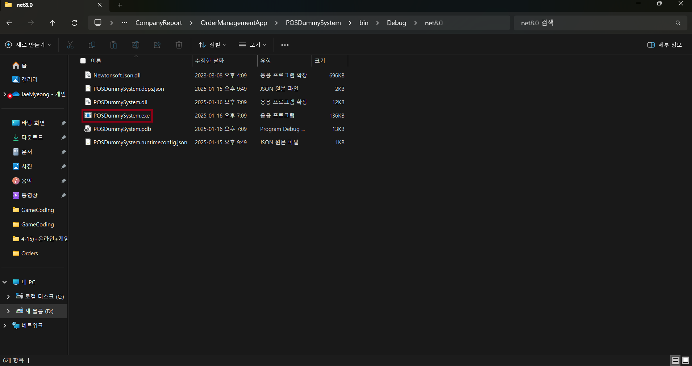
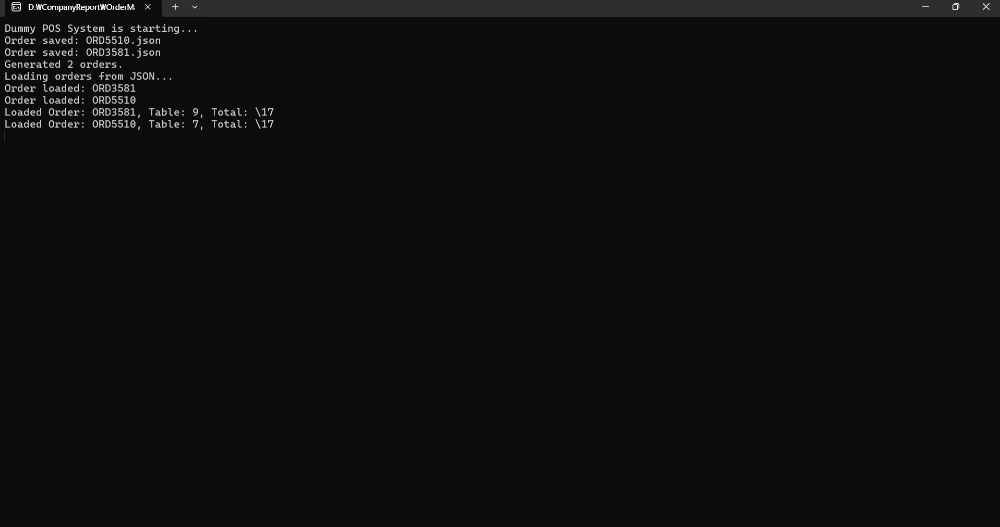
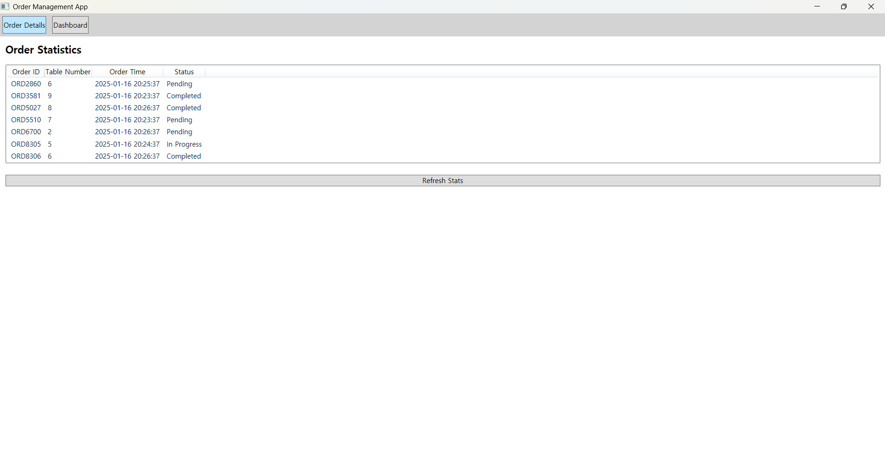

## Pos 시스템과 연동 되는 간단한 주문 관리 윈도우 어플리케이션

### 실행 방법

- 주문 데이터를 시뮬레이션 하는 더미 Pos 시스템 구현

    - OrderManagementApp\POSDummySystem\bin\Debug\net8.0에서서 POSDummySystem.exe 실행
    - 실하면 D://Order 폴더에 Json 파일 생성

    
    

-  메인 윈도우 애플리케이션

    -  OrderManagementApp\bin\Debug\net8.0-windows에서 OrderManagementApp.exe 실행
    
